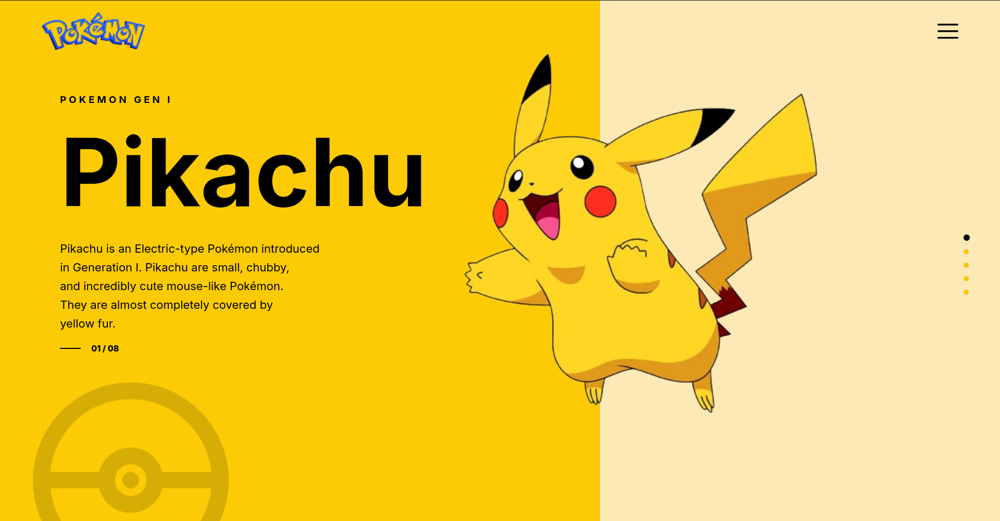

# Pokémon Landing Page UI

A modern Pokémon-themed landing page inspired by clean and minimal UI designs.

---

# Live Link

https://cohort30-sheryians-pika-web.vercel.app/

---

## 📸 Design Screenshot



---

## 🎨 Features

- Split background layout
- Modern typography
- Responsive flexbox layout
- Custom Pokémon theme
- Soft shadows and gradients
- Decorative background elements
- Vertical navigation dots
- Interactive modern UI feel

---

## 🛠️ Technologies Used

- HTML5
- CSS3
- Flexbox
- Google Fonts

---

## 📂 Project Structure

```bash
easy/
│
├── index.html
├── style.css
├── images/
├── icons/
└── preview.png
```

---

## 🧠 What I Learned

- Positioning elements using Flexbox
- Creating split-screen layouts
- Using gradients and opacity effects
- Working with z-index and layering
- Modern UI spacing techniques
- Custom shadows and glow effects

---

## 🔗 GitHub Repository

https://github.com/nimay003/cohort3.0-sheryians

---

⭐ Built while practicing frontend development.
