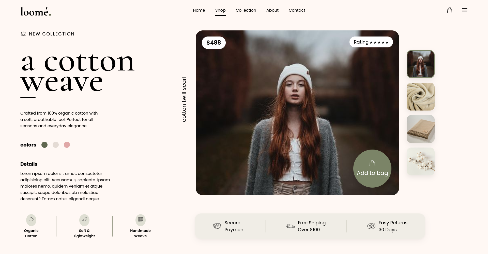

# Loomé Fashion Landing Page

A luxury fashion landing page inspired by modern editorial and e-commerce UI designs.

---

## 📸 Design Screenshot



---

## 🎨 Features

- Luxury minimal UI design
- Split layout structure
- Elegant typography
- Modern product showcase section
- Vertical text design
- Floating add-to-bag button
- Soft premium shadows
- Smooth neutral color palette
- Product gallery section
- Feature information panel

---

## 🛠️ Technologies Used

- HTML5
- CSS3
- Flexbox
- Google Fonts

---

## 📂 Project Structure

```bash
hard/
│
├── index.html
├── style.css
├── images/
├── icons/
└── preview.png
```

---

## 🧠 What I Learned

- Creating premium landing page layouts
- Using Flexbox for complex UI alignment
- Building vertical text sections
- Working with absolute positioning
- Creating modern shadows and glassmorphism effects
- Designing reusable UI components
- Improving spacing and typography hierarchy

---

## ✨ UI Highlights

### Luxury Typography
Elegant serif + sans-serif font combination inspired by modern fashion websites.

### Product Showcase
- Large hero product image
- Floating pricing section
- Product rating pill
- Circular add-to-bag button
- Vertical slogan design

### Modern UI Components
- Rounded image gallery
- Soft neutral color palette
- Minimal navigation
- Premium feature cards

---

## 🎯 Design Inspiration

Inspired by:
- Dribbble fashion concepts
- Modern editorial layouts
- Luxury e-commerce websites

---

## 🔗 GitHub Repository

https://github.com/nimay003/cohort3.0-sheryians

---

⭐ Built while practicing frontend development and modern UI design.