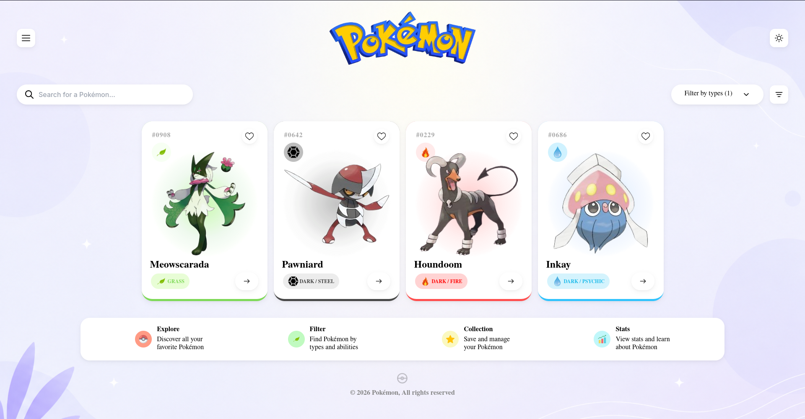

# Pokémon Cards UI

A modern Pokémon-themed card interface inspired by clean dashboard and gaming UI designs.

---

## 🔗 Live Link

https://cohort30-sheryians-poki-card.vercel.app/

---

## 📸 Design Screenshot



---

## 🎨 Features

- Modern Pokémon dashboard UI
- Soft glassmorphism background
- Search bar with filter section
- Dynamic Pokémon cards
- Custom glow effects for each Pokémon type
- Responsive flexbox layout
- Minimal modern shadows
- Floating UI elements
- Interactive card design

---

## 🛠️ Technologies Used

- HTML5
- CSS3
- Flexbox
- Custom Gradients
- Google Fonts

---

## 📂 Project Structure

```bash
medium/
│
├── index.html
├── style.css
├── images/
├── icons/
└── preview.png
```

---

## 🧠 What I Learned

- Building card-based UI layouts
- Creating soft UI shadows
- Using radial gradients for glow effects
- Positioning elements with Flexbox
- Working with modern dashboard layouts
- Creating responsive sections
- Improving UI spacing and alignment

---

## ✨ UI Highlights

### Pokémon Type Glow Effects
Each Pokémon card contains custom background glow effects based on its type:
- Grass → Green glow
- Fire → Red glow
- Water → Blue glow
- Dark/Steel → Gray glow

### Modern Components
- Rounded cards
- Floating search bar
- Feature information section
- Soft pastel background
- Minimal icon system

---

## 🔗 GitHub Repository

https://github.com/nimay003/cohort3.0-sheryians

---

⭐ Built while practicing frontend development and modern UI design.
