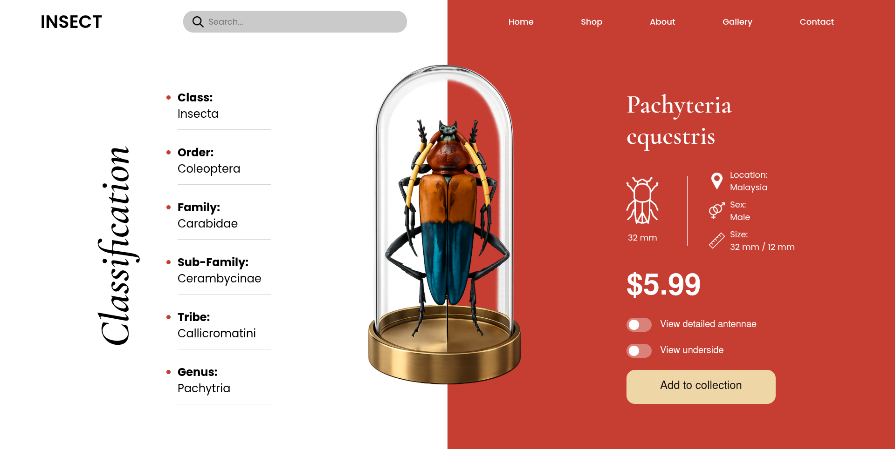

# Insect Collection Landing Page

A modern editorial-style insect showcase landing page inspired by luxury museum and specimen collection interfaces.

---

## 📸 Design Screenshot



---

## 🎨 Features

- Split-screen modern layout
- Editorial luxury UI design
- Glass dome specimen showcase
- Minimal premium typography
- Interactive toggle switches
- Elegant product information layout
- Vertical classification text
- Modern soft-shadow effects
- Rich red and neutral color palette

---

## 🛠️ Technologies Used

- HTML5
- CSS3
- Flexbox
- Google Fonts

---

## 📂 Project Structure

```bash
hard part 2/
│
├── index.html
├── style.css
├── images/
├── icons/
└── preview.png
```

---

## 🧠 What I Learned

- Creating editorial split-screen layouts
- Working with layered positioning
- Building custom toggle switches
- Designing premium UI sections
- Using typography hierarchy effectively
- Creating realistic glassmorphism effects
- Improving alignment and spacing systems

---

## ✨ UI Highlights

### Glass Dome Showcase
A centered premium insect specimen display using:
- Transparent glass effects
- Gold metallic base
- Layered object positioning

### Editorial Layout
- Left classification section
- Center product showcase
- Right information and controls section

### Interactive Components
- Custom toggle switches
- Styled search bar
- Modern CTA button
- Responsive navigation

---

## 🎯 Design Inspiration

Inspired by:
- Editorial museum websites
- Luxury specimen showcase concepts
- Modern product presentation UIs
- Dribbble premium web concepts

---

## 🔗 GitHub Repository

[cohort3.0-sheryians](https://github.com/nimay003/cohort3.0-sheryians?utm_source=chatgpt.com)

---

⭐ Built while practicing advanced frontend UI design and layout techniques.