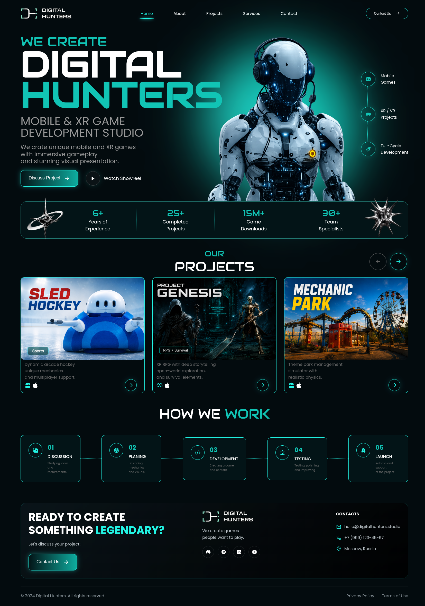

# 🎮 Digital Hunters - Futuristic Gaming Website

A modern futuristic gaming studio landing page built using HTML and CSS.  
This project features a cyberpunk-inspired UI with glowing effects, futuristic typography, game showcase cards, animated sections, and a premium dark theme.

---

# 🚀 Live Demo

🌐 https://cohort30-sheryians-gaming-website.vercel.app/

---

# 📸 Website Preview

## 🖥️ Full Website Screenshot

> Add your website screenshot here

```md

```

---

# ✨ Features

- Futuristic Gaming UI
- Neon Glow Effects
- Responsive Layout
- Modern Navigation Bar
- Hero Section
- Game Showcase Cards
- Animated Buttons
- Statistics Section
- Professional Footer
- Cyberpunk Design Style

---

# 🛠️ Technologies Used

- HTML5
- CSS3
- Remix Icons
- Google Fonts

---

# 📂 Folder Structure

```bash
Ass3/hard
│
├── index.html
├── style.css
├── images
├── icons
└── README.md
```

---

# 🎨 UI Highlights

## 🔥 Hero Section
- Futuristic robot image
- Neon circular glow
- Gaming studio branding

## 🎮 Project Cards
- Game showcase layout
- Hover glow effects
- Modern card design

## 📊 Stats Section
- Gaming experience highlights
- Neon typography
- Futuristic separators

## 🧩 Footer
- Contact section
- Social media icons
- Glassmorphism inspired UI

---

# ⚡ Installation

Clone the repository:

```bash
git clone https://github.com/nimay003/cohort3.0-sheryians.git
```

Open the project folder:

```bash
cd Ass3/hard
```

Run the project using Live Server.

---

# 👨‍💻 Author

## Nimay

GitHub:
https://github.com/nimay003

---

# ⭐ Support

If you liked this project, give it a ⭐ on GitHub.