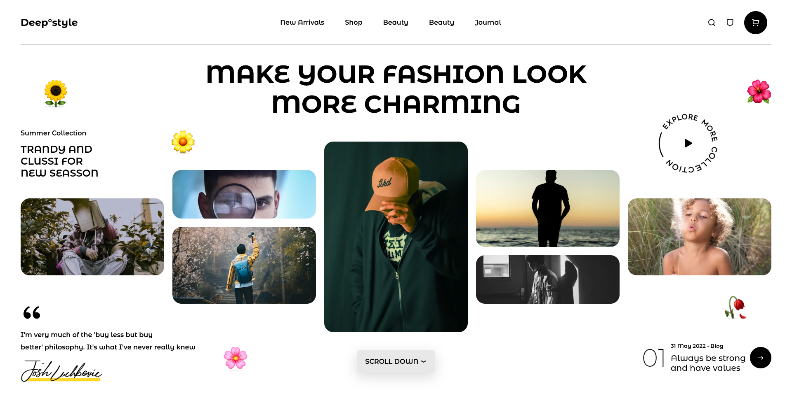

# Deep°style Fashion Landing Page
A modern and stylish fashion landing page inspired by premium UI/UX layouts.
This project was created as part of Cohort 3.0 - Sheriyans Coding School assignment practice.

---

# 🚀 Live Demo

🌐 https://cohort30-sheryians-hard-part1.vercel.app/

---

# 📸 Website Preview

## 🖥️ Full Website Screenshot



---

# ✨ Features

- Modern Fashion UI
- CSS Grid Layout
- Responsive Structure
- Stylish Typography
- Image Card Layout
- Circular Explore Text Design
- Clean Navigation Bar
- Custom Shadows & Rounded Cards

---

# 🛠️ Technologies Used

- HTML5
- CSS3
- CSS Grid
- Remix Icons
- Google Fonts

---

# 📂 Folder Structure

```bash
Ass3/hard
│
├── index.html
├── style.css
├── img and icons
└── README.md
```

---

# ⚡ Installation

Clone the repository:

```bash
git clone https://github.com/nimay003/cohort3.0-sheryians.git
```

Open the project folder:

```bash
cd Ass3/hard
```

Run the project using Live Server.

---

# 👨‍💻 Author

## Nimay

GitHub:
https://github.com/nimay003

---

# ⭐ Support

If you liked this project, give it a ⭐ on GitHub.